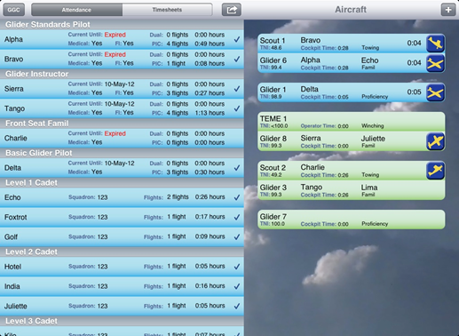
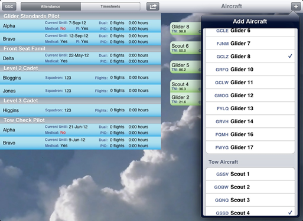
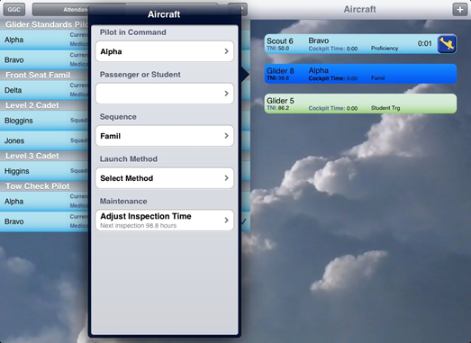
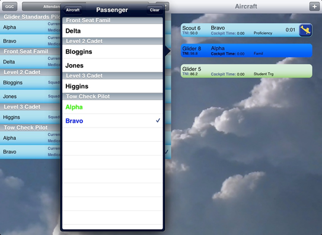
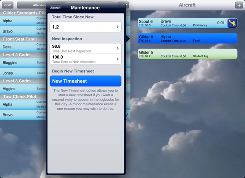

# Aircraft Area

Each aircraft is represented by a strip on the right hand side of the screen.

Blue strips represent airborne aircraft, green strips are aircraft on the ground.

## Adding Aircraft to the Field

Touch the + to add aircraft or winches to the field

Aircraft or winches can be removed by using the swiping gesture however, they must first be ‘unhooked’ from other aircraft. Tap on either the glider or the launch vehicle, then select ‘Unhook’ in the pop-over menu.

## Hookup

Touch the aircraft strip to select the pilot, passenger, and sequence. Choosing a launch method will “hook up” the glider to the launch vehicle.

If you hook a glider to the wrong launch vehicle, tap on either the glider or tow plane/ winch, then select ‘Unhook’ in the pop-over menu

## Passenger Selection

When selecting pilots and passengers, names appearing in green mean the pilot is in a non-airborne aircraft. Names that appear in blue mean the pilot is currently flying. For passengers, a check mark indicates the person has been flown at least once during the current day.

## Launching and Landing Aircraft

Press  or  to begin recording times when an aircraft takes off.

Press  or   to finish recording times when an aircraft lands.

These actions automatically generate timesheet records.

## Aircraft Maintenance

The airplane maintenance area is found by touching the aircraft strip to access the pop-over. The ‘maintenance’ button is found at the bottom of the pop-over.

In this screen, the the TTSN, TNI, and TTNI can be manually adjusted.

The ‘New Timesheet’ option will log all future flights as a separate journey log entry. This is for when you have snags or maintenance during the day. The ‘New Timesheet’ option should not be used routinely (eg. the app will automatically print the timesheets on multiple pages if needed, no intervention is required).

## Aircraft Area Notes

The ‘PIC cockpit time’ resets when the pilot has been on the ground more than 25 minutes. It only looks at the most recent flights where the pilot has acted as the PIC. Dual flights are not considered in this calculation.

The PIC time and TNI are color coded and will progressively turn yellow, orange and then red as the PIC approaches 2.5 hours in the cockpit or the aircraft approaches 0 hours TNI.

The TNI for the winch is approximate, since the app cannot know exactly how long the winch has been running. More accurate times can be manually entered.

The ‘Apache counter’ and ‘Bandit counter’ appear during  student training. This only counts the number of student training flights done for students in that flight. This is similar to the ‘x-board’ used at many CFTCs. It does not count proficiency flights, fam flights, or anything else.

## Adding Flight in the past

### Preparing

### Add the flight

### Modify flight information
