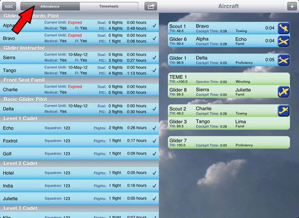
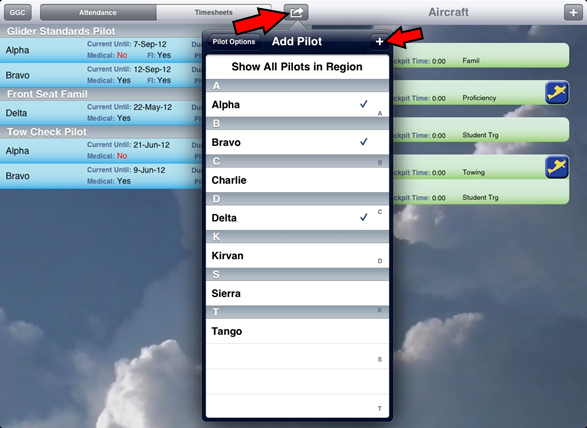
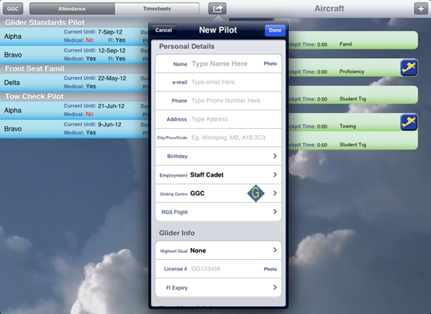
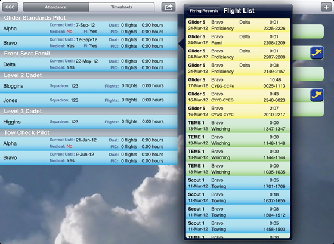

# Attendance

The attendance area is found on the left side of the app. It shares the same space as the ‘timesheet area’

Select the Attendance button at the top left to toggle to the attendance screen

## Sign in new pilots

Touch ‘Sign in Pilot’ in the top centre menu, then touch the pilot’s name to sign them in.

Press the [+] to add new names

In the pop-over, swipe to ‘Inactivate’ a pilot so they do not show up in the menu. Adding a new pilot with the same name and birthday will reactivate them.

## Add a new pilots

When a new pilot is added the only mandatory info is the name, highest glider qual and/or highest scout qual, and employment type.

For a staff member to be able to run the winch, their qualification must be recorded in the ‘Other Quals’ section

Information and Quals can be updated at any time by touching on the pilot’s strip.

Most of the other data fields are to support future PTR functionality.  The app cannot currently be used in place of a PTR.

## Pilot Information Summary

Touching a pilot’s strip will open a pop-over with areas to edit information and quals. At the bottom of the pop over, selecting ‘Flight List’ shows all of the flights and winch launches a pilot has completed. Similarly, selecting ‘Attendance Records’ shows their attendance.

## Additional Notes

When a pilot leaves, swipe to sign them out. Signing pilots out allows the app to record their time in and out and whether it was a session or not. In turn, this allows the app to keep track of your paid days used. If a pilot is not signed out by midnight, the app will assume they left at 1730.

Filling out the ‘employment type’ is very important because this is used to calculate paid days as well as cadet attendance stats

If an email address is added for a pilot, whenever the ‘Email Pilot Logs’ feature is used they will receive an email with their flight times, provided they had flown on the day in question. 

The birthday field is not ‘mandatory’ but it is recommended to distinguish between pilots with identical names (eg. Smith)

The currency dates that are displayed take into account ACGP currency rules as well as TC currency rules (5 flights PIC in six months). They do NOT include APC requirements nor launch method specific currency requirements.

It is possible to take a picture using the iPad camera that will appear next to the person’s name to facilitate identification for new staff members.

It is not recommended that you take photos of licenses and medicals as the iPad is not authorized for PTR use at this time.

If squadron officers are flown, they should be added as ‘guests’, not as cadets. This ensures the ‘cadets flown’ statistics will be accurate.

All of the cadets can be signed out at once, but caution is recommended as there is no easy way to reverse this. Entire summer camp flights can be easily signed in/out.