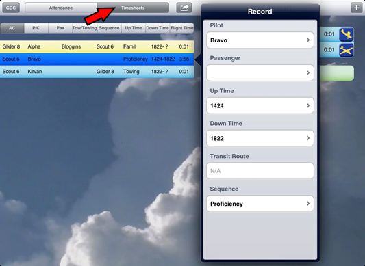
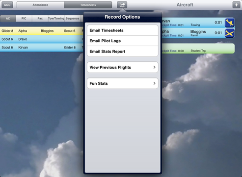

# Timesheets Area

The timesheet / record area is found on the left side of the iPad. It shares the same area as ‘attendance’ and is accessed by selecting the ‘Timesheets’ toggle button

## Flight Records

Records automatically appear as aircraft strips, on the right, are taken off and landed.

Touching a completed flight opens a pop-over which allows the details of the flight to be edited.

A flight that is currently airborne can be edited by touching the aircraft strip in the ‘Aircraft Area’.

Records can be deleted by using the ‘swipe to delete’ gesture. If you delete a glider flight, it will also delete the associated record for the launch vehicle. Similarly, if the record for a launch vehicle is deleted, the associated glider record is also deleted.

## Timesheets Area Notes

The app greatly reduces the work needed complete mandatory reports
At the end of the day the timesheets can be emailed and printed.

If winch launch was used, at the end of the day the app will request the actual winch TNI. What is shown during the day is only an estimate.

At the end of the weekend the stats report can be easily emailed to maintenance and Air Ops.

A list of new quals awarded must be submitted to air ops periodically. The app does not do this automatically.

## Viewing Previous Days

Records from previous days are read only, so it is important to be sure everything is right before the end of the day!

Records from previous days can be viewed and emailed. This works the same way as when timesheets and pilot logs are emailed at the end of the current day.

## Additional Notes

Records can be sorted several ways (eg. to sort first by name and then by flight time, simply touch the name header then the flight time header). The iPad will remember previous sort settings.

During transit flights the iPad will attempt to log the route using GPS. If it is not accurate or if the iPad was not brought on the flight it can be manually recorded.

If you land the wrong airplane, you may shake the iPad to undo the mistake
Times are displayed in the current local time zone. If the flight has crossed time zones, all flight records will display times in the time zone the iPad is currently located in.

You CAN switch to other apps while using the Timesheets app. You can even turn the iPad off, or force quit the app, and when you go back into it everything will still be there. However, the more time you spend using apps on the iPad the faster the battery will run out.